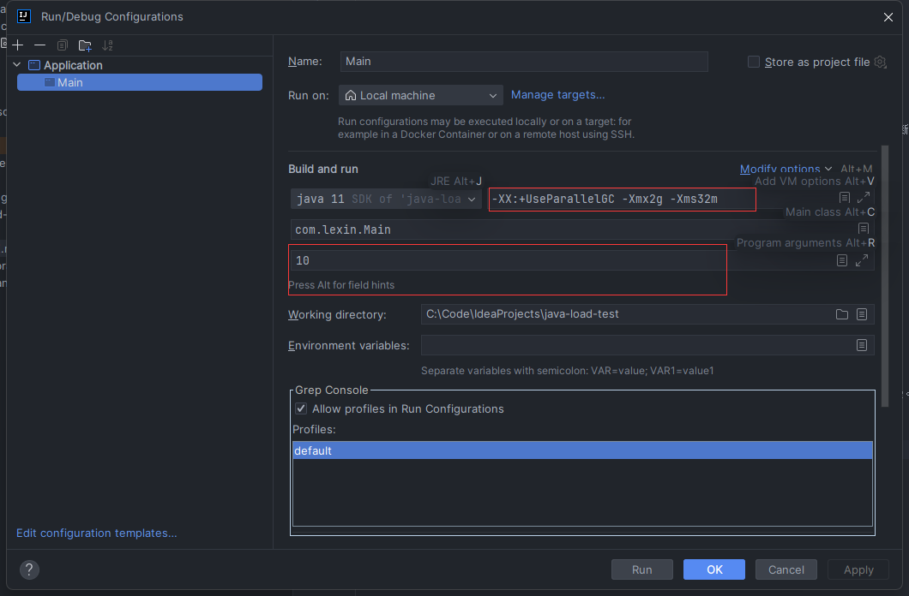

# java-load-test

用于测试GC性能的工具项目

## Preparation

本项目代码基于JDK11开发，请确保你已经安装JDK11。

## Get Started

克隆本项目，运行main类即可开始测试，该程序会循环读取命令行的输入，当读取到回车后，该程序会通过不断生成对象以消耗JVM内存。
如果你是命令行运行，可以添加如下参数以控制使用的GC和堆大小：
```shell
-Xmx2g -Xms32m
```
使用如下命令指定G1作为垃圾回收器：
```shell
-XX:+UseG1GC
```
使用如下命令指定Parallel GC作为垃圾回收器：
```shell
-XX:+UseParallelGC
```

该程序还接受一个命令行参数作为生成对象的间隔（单位：毫秒），你可通过提供该参数来控制内存占用的快慢。

如果你使用的是idea，那么可以通过下图的方式配置上述参数


建议使用[Jprofiler](https://www.ej-technologies.com/products/jprofiler/overview.html)对程序进行运行时诊断。

